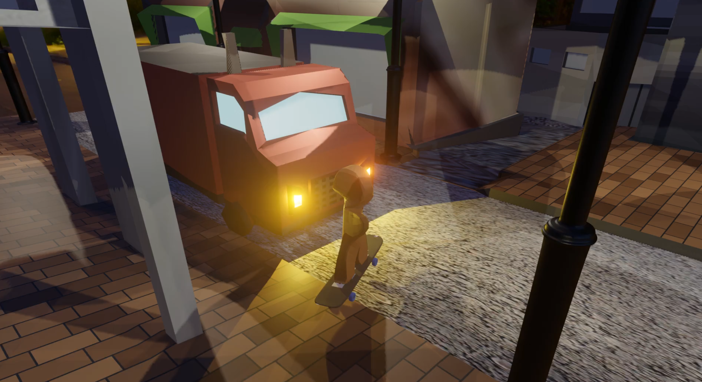
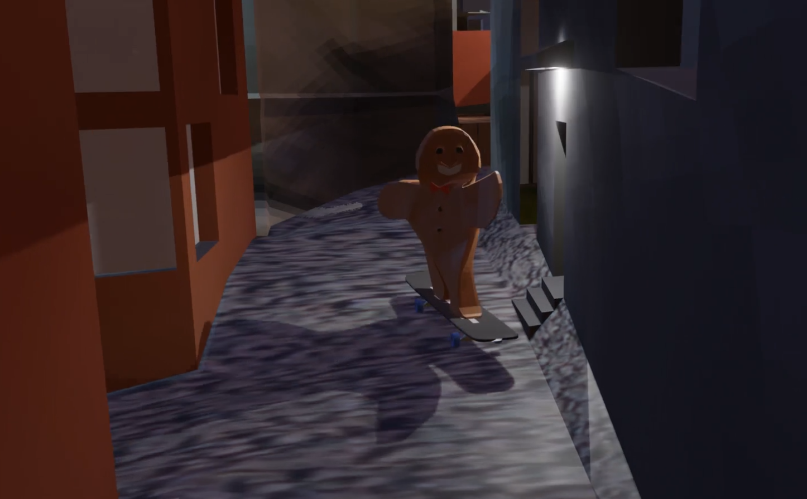

# III. Animationsvideo "City Skating"
Das Animationsvideo wurde mithilfe des Programms “Blender” von mir in Zusammenarbeit mit einem Kommilitonen im 1. Semester konzipiert. Alle Modelle, Animationen und Texturen sind eigenständig erstellt worden.  

## Galerie

## Video

<iframe style="width:100%;height:100%;position:absolute;left:0px;top:0px;" width=100% height=100% src="https://youtube.com/embed/4kjF9ABJtE0" frameborder="0"></iframe>

