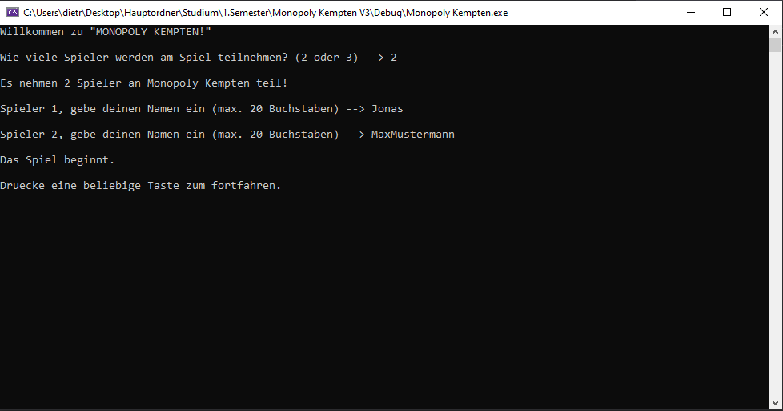
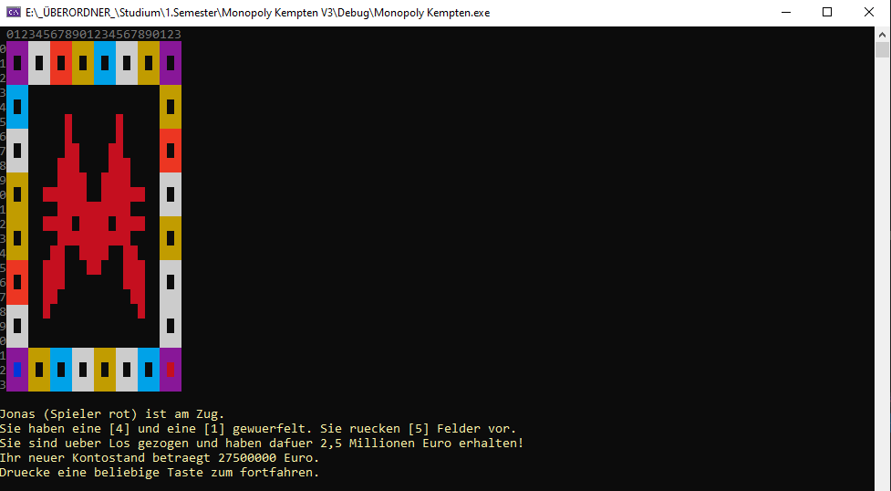
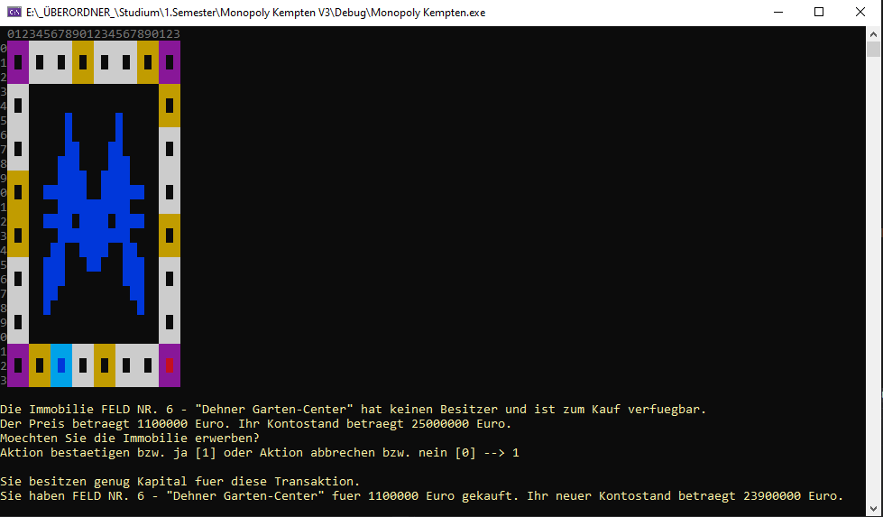

# I. Spieleprojekt “Monopoly Kempten”
“Monopoly Kempten” ist eine konsolenbasierte, kleinere Version des bekannten Spiels “Monopoly”. Das Spiel wurde von mir in C++ geschrieben. Die Spieler führen ihre Aktionen mittels textbasierten Konsoleneingaben durch. Es wird grafisch dargestellt, an welcher Stelle sich die Spielfiguren befinden und wer der Eigentümer eines Immobilienspielfelds ist.

## Galerie

