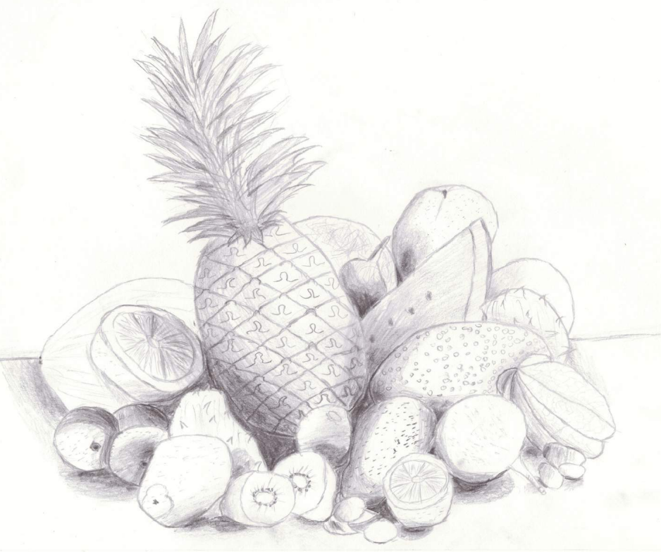
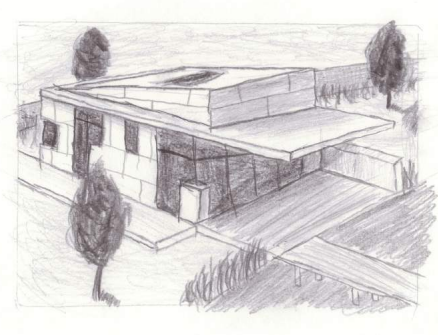

# V. Zeichenmappe
Im Laufe des 2. Semesters ist eine Zeichenmappe entstanden, welche vielerlei Motive, darunter Stillleben, Architektur, Landschaften, Charaktere und Mimik, beinhaltet.

## Galerie

## Dokumentation
Die ganze Zeichenmappe können Sie [hier](Zeichenmappe.pdf) ansehen.
