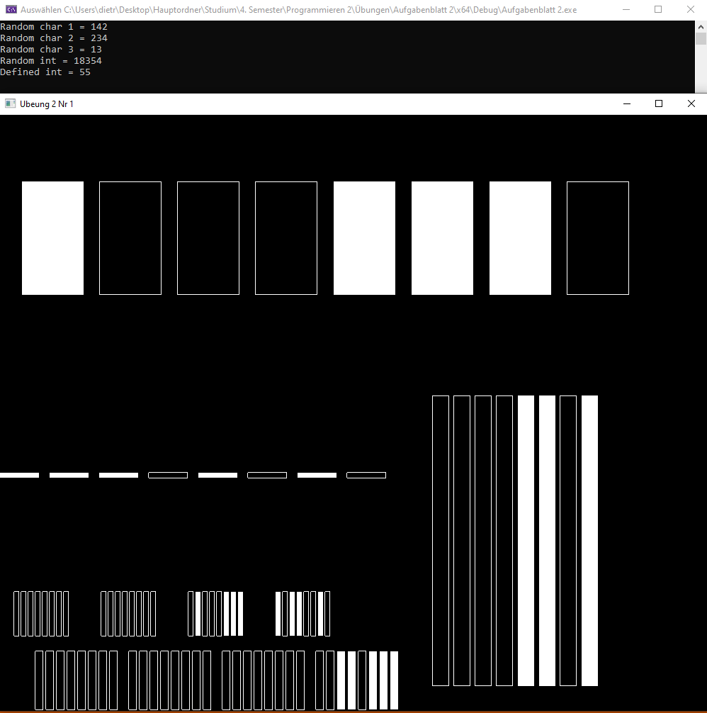
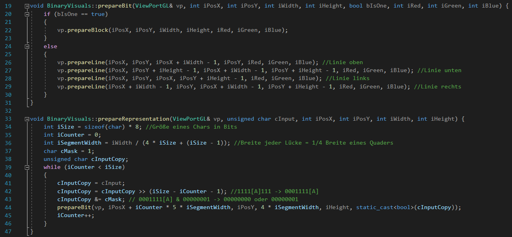
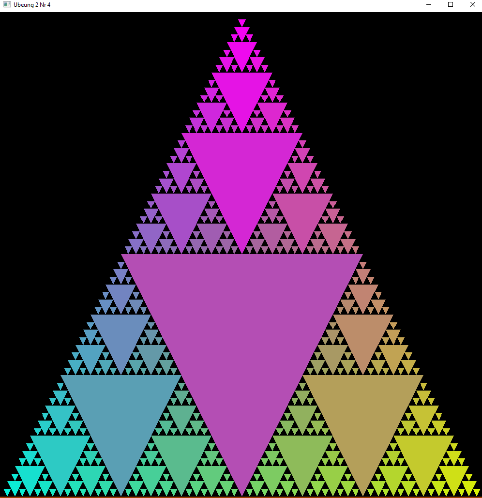
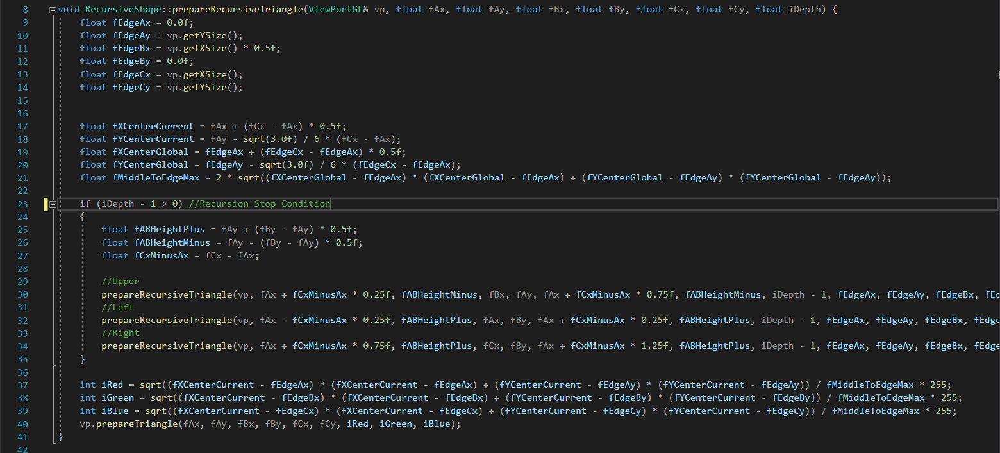
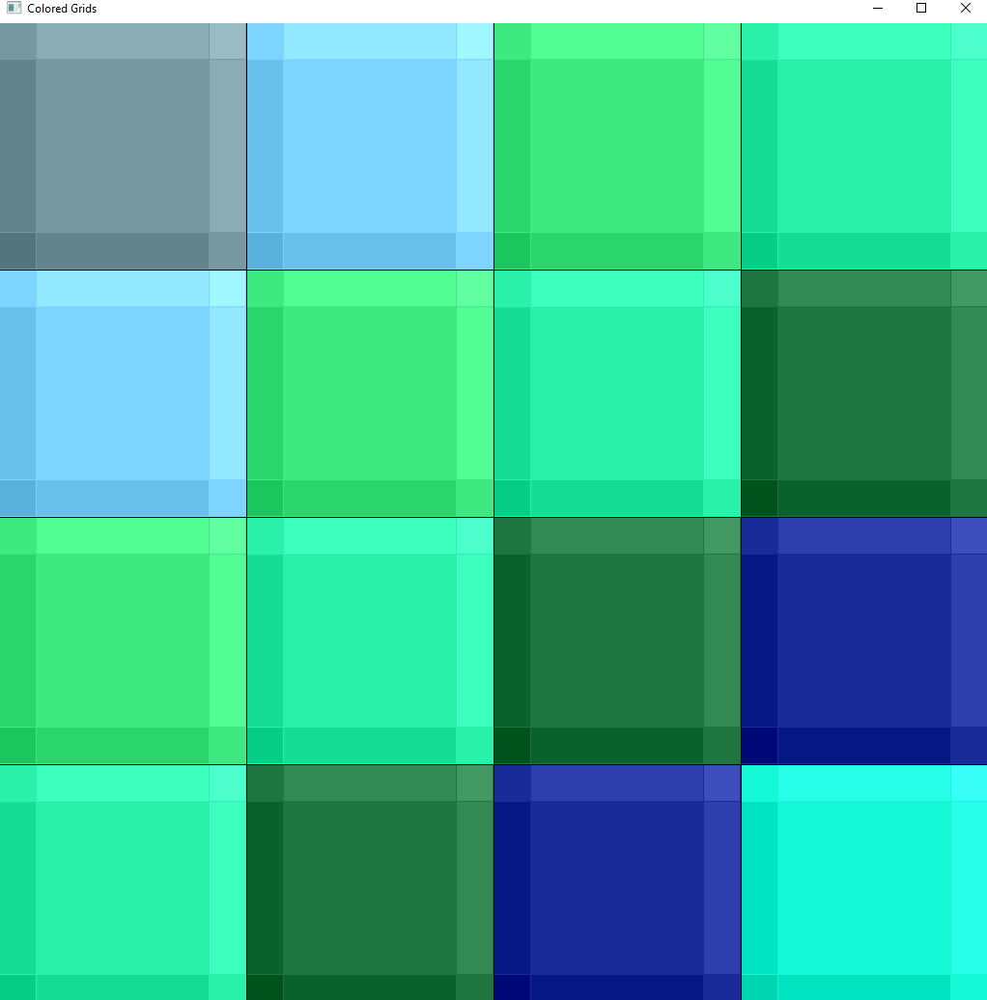
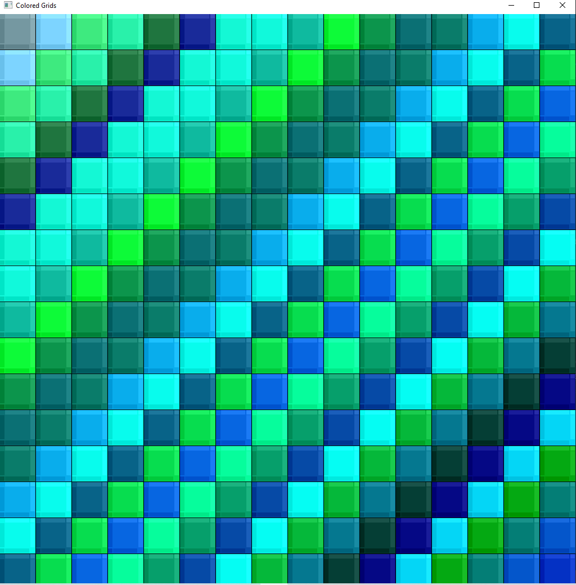
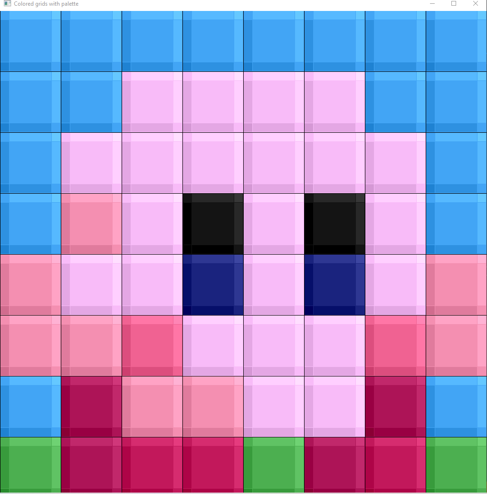
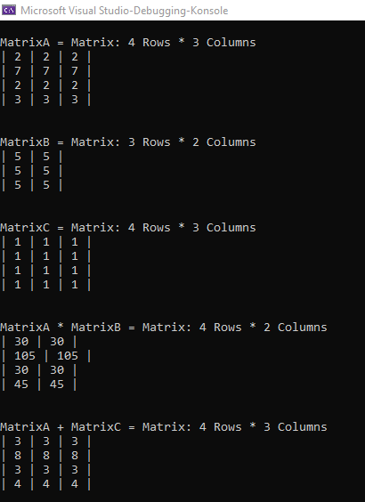
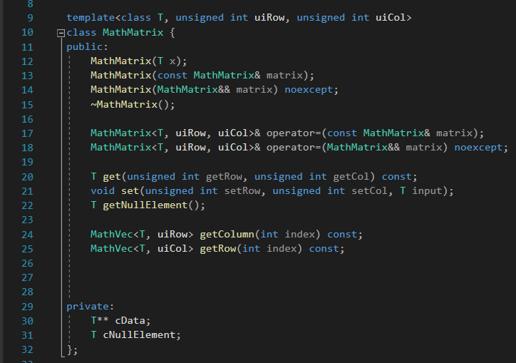
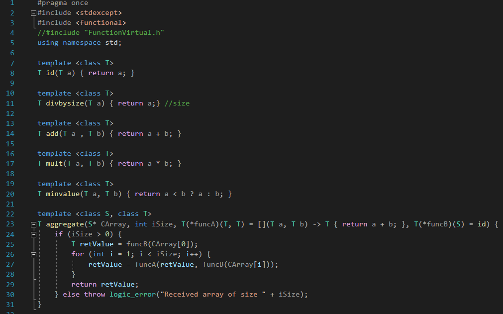

# VI. Programmierbeispiele
Im folgenden sehen Sie eine Auswahl veschiedener Übungsaufgaben, die im Rahmen der Vorlesung "Programmieren 2" in C++ entstanden. In einigen Aufgaben hatte man Zugriff auf ein simples Framework, mit welchem man ein variabel großes Bildschirmfenster erstellen konnte und die Pixel einzeln ansprechen um deren Farbe zu setzen. Die Codeausschnitte sollen einen groben Einblick in meine Struktur und Syntax geben.

## Binärzähler
Funktion: Visualisierung von Zahlen in Binärdarstellung als Char (8 Bit) oder Integer (32 Bit)
Themen: Bitshifting

## Dreieck
Funktion: /
Themen: Rekursion

## Grafikgitter
Funktion: Erzeugung von wiederholenden Mustern und Darstellung von Bildern bei skalierbarer Quadratgröße und Auflösung
Themen: Ausnahmenbehandling (try/catch), dynamische Arrays, Wiederholung Vererbung

## Matrizenrechner
Funktion: Berechnen von Operationen auf selbst definierten Vektor- und Matrixklassen
Themen: Templates, Operatorüberladung, R- und L-Values

## Alternative Funktionsaufrufe
Funktion: Aufruf von Funktionen ohne die Verwendung herkömmlicher Funktionsaufrufe
Themen: Funktoren, Lambda-Ausdrücke, Funktionsobjekte

