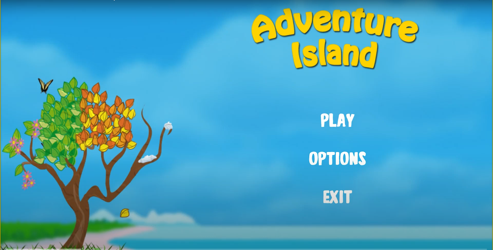
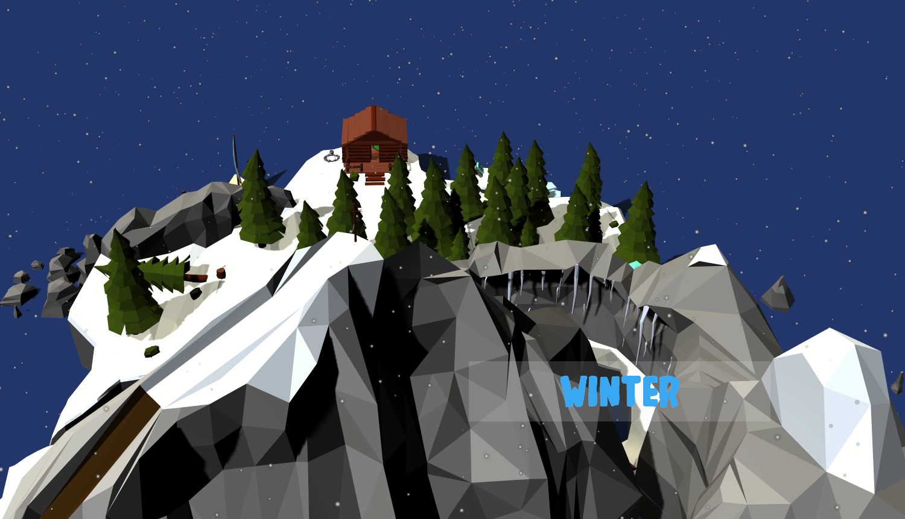

# II. Spieleprojekt "Adventure Island"
Bei “Adventure Island” handelt es sich um ein dreidimensionales Open-World Puzzle-Spiel, bei dem der Spieler vier Spielwelten mit verschiedenen Jahreszeiten durchquert. Es wurde mithilfe der Game-Engine “Unity”, welche auf der Programmiersprache C# basiert, im 3. Semester als Gruppenarbeit kreiert. 
Als Teil eines vierköpfigen Teams war ich für die Winterinsel zuständig, wobei ich sowohl im Bereich der Modellierung, als auch der Programmierung tätig war. 

## Galerie

## Trailer

<iframe style="width:100%;height:100%;position:absolute;left:0px;top:0px;" width=100% height=100% src="https://youtube.com/embed/EVzEL-fg2vQ?start=223" frameborder="0"></iframe>

## Dokumentation
Die ausführliche Dokumentation zu dem Spiel können Sie bei Bedarf [hier](Dokumentation Adventure Island.pdf) nachlesen.
